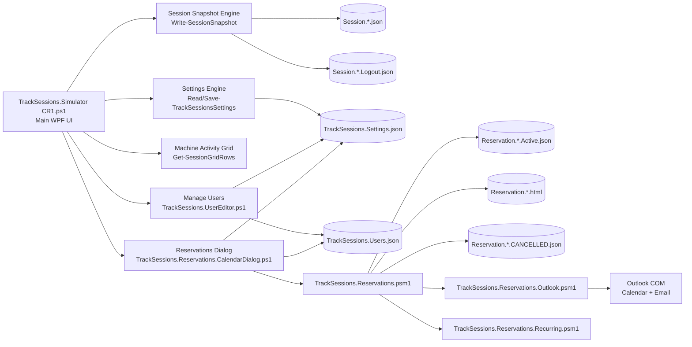
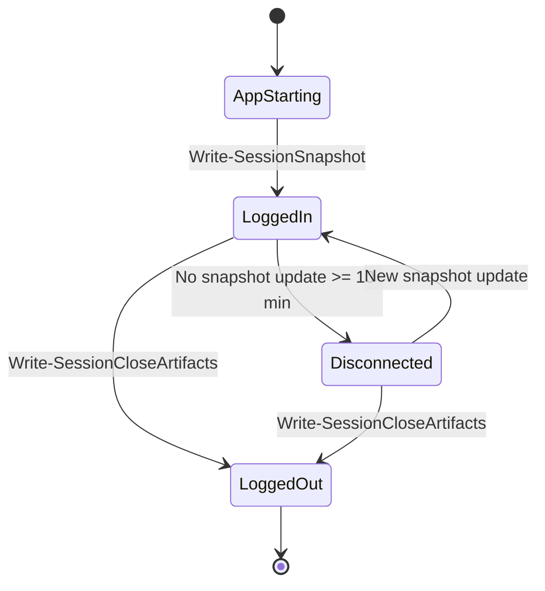
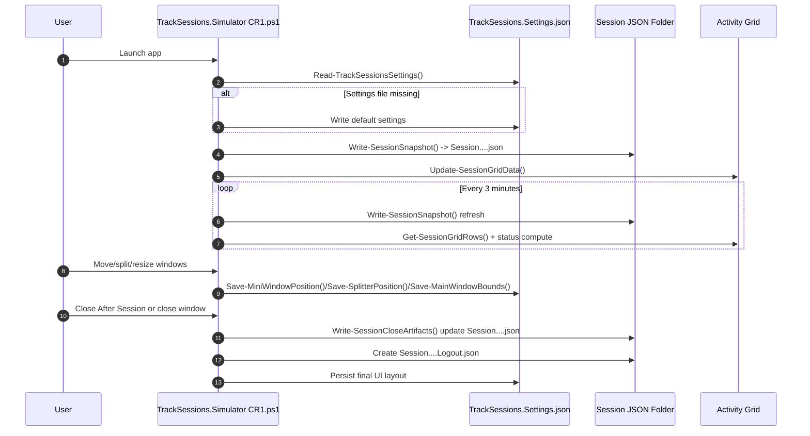
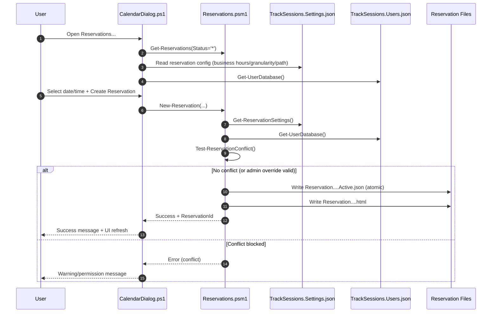
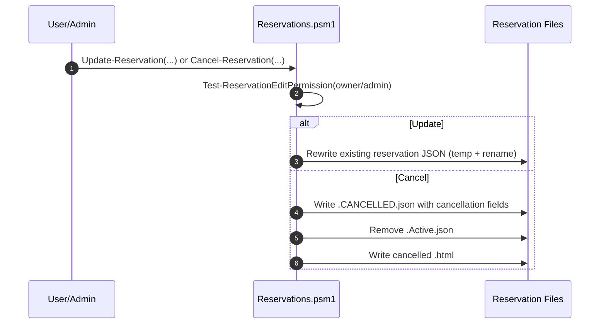
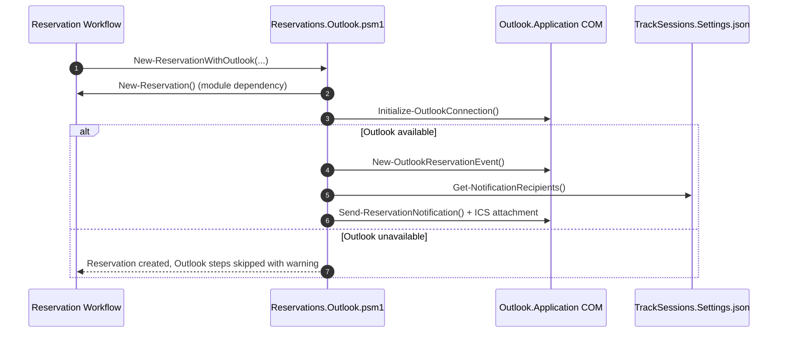

# TrackSessions Architecture

## 1) Purpose and Scope

TrackSessions is a PowerShell 5.1 WPF application family for:

- Tracking interactive user sessions on Windows machines (especially PAWS machines).
- Persisting machine/user session state to JSON snapshots.
- Showing live status of tracked machines (Logged In / Logged Out / Disconnected).
- Managing machine reservations (calendar, conflict checks, admin override, cancel flow).
- Managing user directory metadata used by reservations and UI identity display.

This document covers the current active architecture centered on:

- `TrackSessions.Simulator CR1.ps1` (current primary launcher/UI)
- `TrackSessions.Reservations.psm1` (reservation core)
- `TrackSessions.Reservations.Outlook.psm1` (Outlook/calendar/email integration)
- `TrackSessions.Reservations.Recurring.psm1` (recurrence extension)
- `TrackSessions.Reservations.CalendarDialog.ps1` (reservation calendar UI)
- `TrackSessions.Reservations.SettingsDialog.ps1` (reservation admin settings UI)
- `TrackSessions.UserEditor.ps1` (user/admin editor)

Legacy and copy scripts are listed in the inventory section for completeness.

---

## 2) High-Level Architecture

---

## 3) Runtime Lifecycle (Main App)

### 3.1 Startup flow

1. `TrackSessions.Simulator CR1.ps1` starts, loads WPF assemblies.
2. Resolves `TrackSessions.Settings.json` path.
3. Calls `Read-TrackSessionsSettings`:
   - Creates default settings file if missing.
   - Normalizes and returns expected settings shape.
4. Resolves output folder mode (`default` local vs configured UNC shared path).
5. Creates current session file name:
   - `Session.{AppVersion}.{Machine}.{UserId}.{DisplayName}.{TimestampZ}.json`
6. Starts timers:
   - 3-minute snapshot refresh timer.
   - optional simulation timer (5-7 sec random interval).
   - icon animation timer.
7. Writes initial session snapshot with `Write-SessionSnapshot`.
8. Shows UI and continuously refreshes grid data from JSON snapshots.

### 3.2 Ongoing operations

- Every refresh tick, `Write-SessionSnapshot` updates current session JSON.
- `Get-SessionGridRows` enumerates `*.json` and computes row status using `Get-SessionStatusFromSnapshot`.
- Status logic:
  - Logged Out: `*.Logout.json` or closed markers present.
  - Disconnected: no update for >= 10 minutes.
  - Logged In: otherwise.

### 3.3 Close flow

On `Close After Session` or window close:

1. `Write-SessionCloseArtifacts` updates current session JSON with close metadata.
2. Creates companion `.Logout.json` artifact.
3. Saves UI settings (splitter/window/mini position) back to `TrackSessions.Settings.json`.
4. Stops timers and closes windows.

---

## 4) Script and Module Inventory

## 4.1 Primary scripts (current architecture)

- `TrackSessions.Simulator CR1.ps1`: main WPF app, session tracking, settings, machine grid, reservation and user editor launch points.
- `TrackSessions.UserEditor.ps1`: full user CRUD editor for `TrackSessions.Users.json`.
- `TrackSessions.Reservations.CalendarDialog.ps1`: reservation month/day/list UI and create flow.
- `TrackSessions.Reservations.SettingsDialog.ps1`: reservation admin panel for reservation/outlook settings in JSON.

## 4.2 Reservation modules

- `TrackSessions.Reservations.psm1`: core reservation create/read/update/cancel and conflict detection.
- `TrackSessions.Reservations.Outlook.psm1`: Outlook event creation, cancellation, email notifications, ICS creation.
- `TrackSessions.Reservations.Recurring.psm1`: recurring series generation and cancellation helpers.

## 4.3 Other TrackSessions scripts in folder

- `TrackSessions.ps1`
- `TrackSessions.DEMO.Aug2026.ps1`
- `TrackSessions.Simulator.ps1`
- `TrackSessions.Simulator CR1.PrePhase5.ps1`
- `TrackSessions.Simulator CR1.0907.ps1`
- `TrackSessions.Simulator CR1-nct001ma4573619.ps1`
- `TrackSessions.Simulator CR1 - Copy.PreReserve.ps1`
- `TrackSessions.UserEditor.20260908.ps1`
- `TrackSessions.UserEditor-nct001ma4573619.ps1`
- `TrackSessions.UserEditor.Lookup-SEID.CLI.ps1`
- `TrackSessions.Reservations.CalendarDialog.ps1`
- `TrackSessions.Reservations.SettingsDialog.ps1`
- `TrackSessions - Copy.ps1`
- `TrackSessions - Copy (2).ps1`
- `TrackSessions - Copy (2).BeforeDialog.ps1`
- `TrackSessions - Copy (3).ps1`

Note: copy and dated variants generally keep the same architecture pattern but can differ in details.

---

## 5) PowerShell and Platform Dependencies

## 5.1 Assemblies loaded by UI scripts

- `PresentationFramework`
- `PresentationCore`
- `WindowsBase`
- `System.Windows.Forms` (used by some main variants for folder dialog/helpers)

## 5.2 Built-in/platform commands used

- Identity/session: `whoami`, `quser`, ADSI (`System.DirectoryServices`)
- Task registration: `schtasks.exe`
- File/JSON IO: `Get-Content`, `Set-Content`, `ConvertFrom-Json`, `ConvertTo-Json`
- Shell UX: `Start-Process`, clipboard APIs, Windows notifications APIs

## 5.3 Custom modules

- `TrackSessions.Reservations.psm1`
- `TrackSessions.Reservations.Outlook.psm1`
- `TrackSessions.Reservations.Recurring.psm1`

## 5.4 Optional external ecosystem modules/cmdlets

These are probed dynamically and used only if present:

- Active Directory cmdlet: `Get-ADUser`
- Microsoft Graph cmdlet: `Get-MgUser`

## 5.5 COM dependencies

- `Outlook.Application` COM object for calendar/email integration.

---

## 6) Settings and JSON Inventory

## 6.1 Core settings and data

- `TrackSessions.Settings.json`
  - App UI settings, tracked machine list, startup trace, reservation/outlook config sections.
- `TrackSessions.Users.json`
  - User database used by UserEditor and reservation permission/identity logic.
- `TrackSessions.Reservations.Schema.json`
  - Schema/reference documentation for reservation payload shape.

## 6.2 Runtime-generated session JSON

- `Session.{...}.json`
  - Live session snapshot written periodically.
- `Session.{...}.Logout.json`
  - Close artifact written on shutdown/close action.

## 6.3 Runtime-generated reservation JSON/HTML

- `Reservation.{Machine}.{User}.{yyyyMMdd}.{HHmmssStart}.{HHmmssEnd}.Active.json`
- `Reservation.{...}.html`
- `Reservation.{...}.CANCELLED.json`
- `Reservation.{...}.CANCELLED.html`

## 6.4 Environment-specific or historical JSON present in folder

- `TrackSessions.Settings.20260909.json`
- `TrackSessions.Settings-nct001ma4573619.json`
- `TrackSessions.Users.20260909.json`
- `TrackSessions.Users-nct001ma4573619.json`
- `TrackSessions.UsersRizu.Jennifer.bak.json`

These appear to be backup/snapshot variants; active scripts target canonical names unless explicitly changed.

---

## 7) JSON Ownership Matrix (Script + Function + Trigger)

## 7.1 `TrackSessions.Settings.json`

Updated by:

- Script: `TrackSessions.Simulator CR1.ps1`
  - Function: `Read-TrackSessionsSettings`
    - Trigger: first run and settings file missing.
    - Action: writes default settings object.
  - Function: `Save-TrackSessionsSettings`
    - Trigger: helper invoked by multiple actions.
    - Action: full settings JSON overwrite.
  - Function chain: `Append-StartupTrace` -> `Save-TrackSessionsSettings`
    - Trigger: startup/state/minimize/restore/simulation/close trace events.
    - Action: appends bounded trace event list.
  - Function chain: `Save-MiniWindowPosition` -> `Save-TrackSessionsSettings`
    - Trigger: mini panel move/location change.
  - Function chain: `Save-SplitterPosition` -> `Save-TrackSessionsSettings`
    - Trigger: main row splitter drag completed.
  - Function chain: `Save-MainWindowBounds` -> `Save-TrackSessionsSettings`
    - Trigger: main window close.
  - Function chain: `Show-EditSettingsDialog` Save handler -> `Save-TrackSessionsSettings`
    - Trigger: Settings dialog Save & Close.
    - Action: updates `Tracking.SharedPath` and `Tracking.Machines`.

- Script: `TrackSessions.Reservations.SettingsDialog.ps1`
  - Function: `Save-Settings`
    - Trigger: Apply button in reservation admin settings UI.
    - Action: updates reservation and outlook-related settings and admin list.

Primary fields affected over time:

- `MiniWindow.Left`, `MiniWindow.Top`
- `Layout.BottomPaneHeight`, `Layout.WindowLeft`, `Layout.WindowTop`, `Layout.WindowWidth`, `Layout.WindowHeight`
- `Tracking.SharedPath`, `Tracking.Machines[]`
- `StartupTrace.Enabled`, `StartupTrace.Events[]`
- Reservation sections used by module/UI:
  - `Reservations.BusinessHoursStart`, `Reservations.BusinessHoursEnd`, `Reservations.TimeSlotGranularity`
  - `Tracking.ReservationPath`, `Tracking.ReservationAdmins[]`
  - `Outlook.Enabled`, `Outlook.CreateCalendarEvents`, `Outlook.SendEmailNotifications`, `Outlook.EmailDistributionList[]`

## 7.2 `TrackSessions.Users.json`

Updated by:

- Script: `TrackSessions.UserEditor.ps1`
  - Function chain: `Import-Users` (if file missing) -> `Set-Content`
    - Trigger: first load when users file does not exist.
    - Action: writes empty JSON array.
  - Function: `Save-Users`
    - Trigger: Save All button and window-closing save flow.
    - Action: serializes full user collection and overwrites file.

Read by:

- `TrackSessions.Reservations.CalendarDialog.ps1` (`Get-UserDatabase` via module)
- `TrackSessions.Reservations.SettingsDialog.ps1` (`Load-CurrentUser`, user dropdown population)
- `TrackSessions.Reservations.psm1` (`Get-UserDatabase`, admin override checks)

## 7.3 `Session.*.json` and `Session.*.Logout.json`

Updated/created by:

- Script: `TrackSessions.Simulator CR1.ps1`
  - Function: `Write-SessionSnapshot`
    - Trigger: startup and every refresh timer tick (3 minutes), manual refresh.
    - Action: writes/overwrites live session snapshot JSON.
  - Function: `Write-SessionCloseArtifacts`
    - Trigger: Close After Session click and main window close.
    - Action:
      - Updates current session JSON with close markers.
      - Creates `.Logout.json` copy artifact.

Status-driving fields set on close:

- `SessionStatus = Closed`
- `SessionCloseEvent = WindowClosed`
- `SessionClosedAtGmt`
- `LogoutFileCreatedAtGmt`
- `LogoutFileName`

## 7.4 `Reservation.*.json` and reservation HTML

Updated/created by:

- Module: `TrackSessions.Reservations.psm1`
  - Function: `New-Reservation`
    - Trigger: Create Reservation in calendar dialog.
    - Action:
      - validates business hours/granularity/conflicts
      - writes `Reservation....Active.json` (temp + rename atomic write)
      - writes corresponding `.html`
  - Function: `Update-Reservation`
    - Trigger: reservation edit paths (where invoked by consuming UI/scripts).
    - Action: updates existing JSON (temp + rename).
  - Function: `Cancel-Reservation`
    - Trigger: cancellation actions.
    - Action:
      - writes `.CANCELLED.json`
      - removes old `.Active.json`
      - writes cancelled `.html`

## 7.5 `TrackSessions.Reservations.Schema.json`

- Reference schema document.
- Not directly rewritten by runtime scripts in the current implementation.

---

## 8) User/Machine State Model

State resolution logic for grid rows is based on:

1. Explicit close artifacts (`*.Logout.json`, `SessionStatus=Closed`, close fields) => Logged Out.
2. Last update age >= 10 minutes => Disconnected.
3. Otherwise => Logged In.

---

## 9) Session Tracking Sequence (User + Machine)

---

## 10) Reservation Architecture and Flow

## 10.1 Reservation data model behavior

Reservation files are file-based records keyed by filename components:

- Machine
- UserId
- Date
- Start/End time
- Status suffix (`Active` or `CANCELLED`)

Conflict detection is based on overlapping time interval math for same machine/date.

## 10.2 Reservation create sequence

## 10.3 Reservation update/cancel sequence

## 10.4 Outlook integration sequence (optional)

---

## 11) Reservation Permission Model

Current effective permission rules in module logic:

- Owner can edit/cancel own reservation.
- Admin user can edit/cancel any reservation.
- Conflict override requires admin privileges.

Admin identity source:

- User-level flag (`IsAdmin`) in `TrackSessions.Users.json`.
- Reservation admin list from settings (`Tracking.ReservationAdmins[]`) depending on caller path.

---

## 12) Data Paths and Folder Behavior

Main app output folder selection:

1. Default local output folder parameter (`$OutputFolder`, default ProgramData path).
2. If `Tracking.SharedPath` is a valid UNC and available, app switches to shared folder mode.
3. Session and grid read/write operate against effective output folder.

Reservation path selection:

1. If `Tracking.ReservationPath` exists in settings, use it.
2. Else default to `Join-Path <effectiveOutputFolder> Reservations`.
3. Ensure reservation directory exists before create operations.

---

## 13) Operational Notes

- Settings writes are full-file overwrites (single JSON document write).
- Session close writes are protected by a one-time guard (`$script:logoutArtifactsWritten`) to prevent duplicate close artifacts.
- Reservation core uses temp-file then rename for create/update atomicity.
- Calendar dialog refreshes data on timer (30 seconds) and manual refresh.
- User editor supports local + optional external lookup (CSV/AD/Graph) but persists only to local `TrackSessions.Users.json`.

---

## 14) Known Versioning Reality

There are multiple copy and dated variants of scripts in this folder. The CR1 path described above is the canonical current flow. When running a different script variant, verify that:

- it targets the same settings/users file names,
- it keeps the same reservation module signatures,
- and it follows the same close-artifact behavior.

If needed, maintain a per-variant architecture delta appendix.
