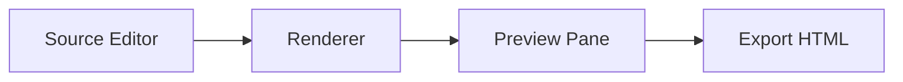

# Vibe Mermaid Render Editor

## Purpose

`VibeMermaidRenderEdit.ps1` is a PowerShell 5.1 WPF editor/preview tool for text-based visual formats. It provides side-by-side source editing and rendering to support iterative diagram/content authoring.

## What You Can Do with Mermaid

Mermaid allows plain-text definitions for diagrams such as:

- Flowcharts
- Sequence diagrams
- State diagrams
- ER diagrams
- Class diagrams
- Gantt charts
- Journey maps

Benefits:

- Diagram source is text and source-control friendly.
- Easy to diff and review in Git.
- Fast to author and refactor.

## Can PowerShell 5.1 WPF Render Mermaid?

Yes, with caveats:

- The WPF `WebBrowser` control can render Mermaid by loading Mermaid JavaScript in HTML.
- The host is IE-engine based, so modern JS compatibility can vary by machine policy.
- This tool now attempts Mermaid -> SVG render through Kroki first, then falls back to browser Mermaid JS if Kroki is unavailable.
- For production-grade stable rendering, Mermaid CLI or a modern host (for example WebView2) is recommended.

## Editor Structure (Implemented MVP)

The implemented editor uses:

1. Top command bar
   - Format selector (`Mermaid`, `SVG`, `HTML`)
   - New/Open/Save
   - Render and Export HTML
   - Auto Render toggle

2. Split main workspace
   - Left: monospaced text editor
   - Right: render preview (`WebBrowser`) + diagnostic error panel

3. Bottom status bar
   - General status messages
   - Selected format info

## Implemented Changes Summary

- Created full `VibeMermaidRenderEdit.ps1` implementation from empty file.
- Added format-aware rendering pipeline:
   - Mermaid text -> Kroki SVG render (primary) with browser Mermaid JS fallback
  - SVG text -> XML validation + inline SVG preview
  - HTML text -> direct preview
- Added auto-render with debounce timer.
- Added open/save support and format detection by file extension.
- Added export of rendered preview to standalone HTML.
- Added template-based New action per format.
- Added status/error reporting in the UI.

## Kroki and Proxy Troubleshooting

If you see:

`Kroki SVG render unavailable (... 407 Proxy Authentication Required ...)`

it means your network requires authenticated proxy access and the Kroki request was blocked.

Current behavior:

- The editor attempts to use system proxy settings and default Windows credentials.
- If Kroki still fails, the editor falls back to browser Mermaid JS rendering.

Recommended actions:

1. Ensure PowerShell can reach Kroki through your proxy with integrated credentials.
2. If your organization hosts its own Kroki, set:

```powershell
$env:KROKI_BASE_URL = 'https://your-kroki-host'
```

3. Relaunch the editor after setting the environment variable.

Note:

- If both Kroki and browser JS fallback are blocked by environment policy, use an offline render path (Mermaid CLI) in a future enhancement.

## Other Formats Suitable for Text + Render Mode

In addition to Mermaid and SVG, this editor pattern can support:

- HTML/CSS
- Markdown (rendered HTML preview)
- Graphviz DOT
- PlantUML
- Vega/Vega-Lite JSON

A future plugin-style renderer abstraction can make format additions straightforward.

## Mermaid Example



## Run

```powershell
powershell.exe -ExecutionPolicy Bypass -File .\Vibe\VibeMermaidRenderEdit.ps1
```
