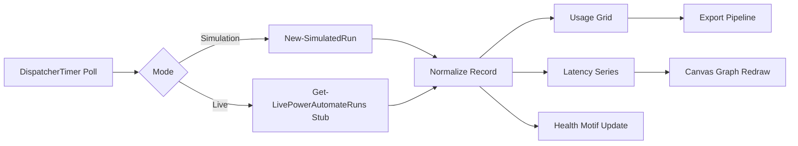
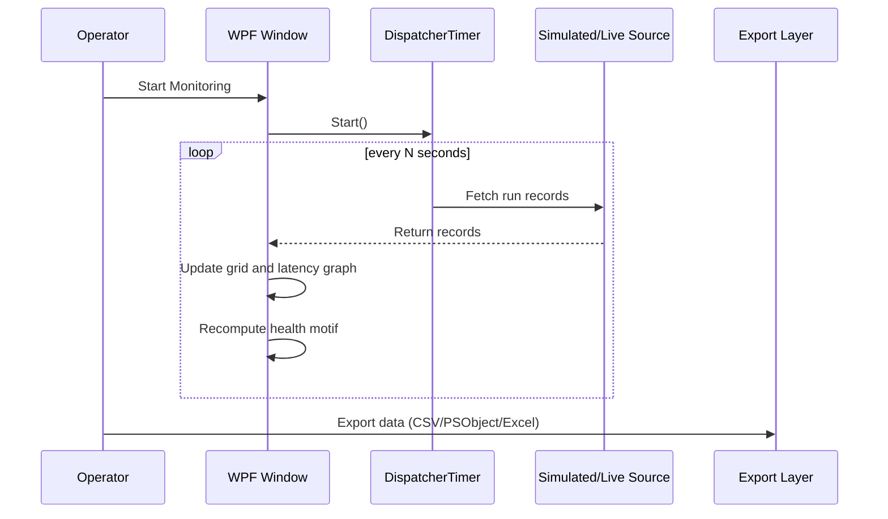

# Vibe Power Automate Usage Graph

## Purpose

`VibePowerAutomateUsageGraph.ps1` is a PowerShell 5.1 WPF dashboard for monitoring Power Automate workflow runs with two operating modes:

- **Simulation**: Generates realistic synthetic usage telemetry.
- **Live**: Uses integration stubs and implementation guidance for cloud data retrieval.

The dashboard is designed to provide immediate operational visibility while creating a clear path to production live data integration.

## Feature Summary

- WPF desktop UI with dark, high-contrast operations theme.
- Live/simulation mode selector.
- Polling timer with configurable interval.
- Scrolling workflow usage log grid.
- Required columns:
  - Environment name
  - Solution
  - Workflow
  - Start time
  - End time
  - Success/Fail
  - Link to workflow run history
- Animated large status motif:
  - Green motif: healthy state
  - Yellow motif: elevated failures or latency
- Rolling latency graph rendered in WPF `Canvas`.
- Horizontal graph scale in **10-second historical increments**.
- Export actions from grid data:
  - CSV
  - PSObject (CLIXML)
  - Fully formatted Excel workbook with chart
- Markdown + Mermaid rendering tab in the same WPF window.

## UI Layout

The window is structured in three major rows:

1. **Control Header**
   - Mode selector
   - Polling interval controls
   - Start/Stop monitoring
   - Export type selector + Export button

2. **Main Monitoring Area**
   - Left panel:
     - Large animated health motif
     - Health headline, detail, and summary stats
     - Scrolling latency graph
   - Right panel:
     - Data grid with run logs

3. **Bottom Tab Region**
   - Markdown and Mermaid view rendered in `WebBrowser`

## Data Model

Every record follows this schema:

- `EnvironmentName` (string)
- `Solution` (string)
- `Workflow` (string)
- `StartTime` (string timestamp)
- `EndTime` (string timestamp)
- `Outcome` ("Success" or "Fail")
- `LatencySeconds` (double)
- `RunHistoryLink` (URL string)

## Health Motif Rules

Health calculation considers recent failures and average latency:

- **Good (Green motif)** when:
  - Failure rate is low, and
  - Average latency is below warning threshold.

- **Warning (Yellow motif)** when either:
  - Failure rate in recent window exceeds threshold.
  - Average latency exceeds threshold.

The motif animation uses a pulsing radial visual to draw attention to state transitions.

## Latency Graph Behavior

- New points arrive on each polling cycle.
- Graph scrolls left conceptually by redrawing a rolling window with newest data at right.
- X-axis tick labels represent **historical seconds** from now, in 10-second increments.
- Y-axis is latency in seconds with static scale (default 0..40 sec).

## Export Details

### CSV

- Uses `Export-Csv` with UTF-8 encoding and no type information.

### PSObject

- Uses `Export-Clixml` preserving object fidelity for PowerShell rehydration.

### Fully Formatted Excel

- Uses COM automation (`Excel.Application`) from PowerShell 5.1.
- Generates workbook with:
  - Styled header row
  - Border formatting
  - Auto-fit columns
  - Latency line chart

## Live Mode Integration Plan

`Get-LivePowerAutomateRuns` is intentionally a stub with detailed comments and extension points.

Potential implementation paths:

1. **REST + Entra ID App Registration (Recommended)**
   - Client credentials OAuth flow
   - Poll Power Platform endpoints for environments/flows/runs
   - Normalize result payloads to dashboard schema

2. **Microsoft Graph (where available and applicable)**
   - Use Graph SDK or raw REST calls
   - Correlate telemetry fields into run records

3. **PowerShell Administration Modules**
   - Use `Microsoft.PowerApps.Administration.PowerShell` for environment/flow metadata
   - Pair with REST run-history retrieval for latency and outcomes

## Mermaid Diagrams

### Architecture



### Polling Sequence



## Running the Script

```powershell
# From the Vibe folder
powershell.exe -ExecutionPolicy Bypass -File .\VibePowerAutomateUsageGraph.ps1
```

## Notes on Mermaid Rendering in WPF

- The script injects Mermaid script from CDN inside WPF `WebBrowser` HTML.
- Rendering may depend on local policy/network availability.
- If Mermaid script cannot load, markdown content still renders and the dashboard remains functional.

## Future Enhancements

- Add authentication profile manager for multi-tenant environments.
- Persist dashboard settings (mode, polling, thresholds).
- Add per-workflow filtering/search in grid.
- Add sparkline per workflow and percentile latency summaries.
- Add alert actions (email/Teams/webhook).

## Prompt Addendum (2026-08-11)

The following additional requirements were provided after the initial implementation:

- Add two zoom buttons at the end of the top control row to zoom the grid (`+` and `-`).
- Add screen tips (tooltips) to all controls.
- Export behavior must open the exported file immediately:
  - `PSObject` export opens in Notepad.
  - `CSV` and Excel exports open in Excel.
- Add a status bar if not already present.
- Status bar must indicate whether Excel is installed (`Yes` or `No`).
- Excel status should include a screen tip showing version information.

## Summary of Changes Implemented

### UI and Usability

- Added grid zoom controls (`+` and `-`) at the end of the header control row.
- Implemented grid zoom scaling with guardrails (minimum and maximum zoom levels).
- Added a bottom status bar containing:
  - General status text (ready state, actions, export state).
  - Excel installation status text.
- Added tooltips to key controls, including mode, polling, start/stop, export controls, zoom controls, grid, chart, markdown viewer, and status area.

### Export Workflow

- Updated export pipeline to launch the exported file immediately after successful export.
- Implemented format-specific open behavior:
  - `PSObject` (`.clixml`) opens in Notepad.
  - `CSV` opens in Excel.
  - `FormattedExcel` (`.xlsx`) opens in Excel.

### Excel Detection and Status

- Added Excel COM detection routine.
- Status bar now displays `Excel Installed: Yes` or `Excel Installed: No`.
- Added Excel status tooltip showing detected Excel version when available.

### Stability and Runtime Hardening (Recent)

- Fixed XAML entity parsing issue (`&` escaped in header text).
- Fixed XAML naming issues for non-framework elements (`x:Name` usage where required).
- Resolved strict mode pipeline/scalar count issue in markdown conversion logic.
- Hardened latency graph sizing against `NaN`/invalid dimensions during initial layout.
- Corrected hyperlink column style target type mismatch causing `ShowDialog()` runtime failure.
- Improved right-grid contrast with explicit row/cell/header/selection styling.

## Affected Files

- `VibePowerAutomateUsageGraph.ps1`
- `VibePowerAutomateUsageGraph.ReadMe.md`

## Version History

| Date (UTC) | Version | Summary | Primary Files |
|---|---:|---|---|
| 2026-08-11 | 1.0.0 | Initial WPF dashboard delivered with simulation/live modes, animated health motif, scrolling latency graph, run log grid, export options, and markdown/mermaid tab. | `VibePowerAutomateUsageGraph.ps1`, `VibePowerAutomateUsageGraph.ReadMe.md` |
| 2026-08-11 | 1.1.0 | Runtime hardening pass: resolved XAML entity/naming issues, strict mode count handling, canvas NaN sizing guard, hyperlink style target mismatch, and grid readability improvements. | `VibePowerAutomateUsageGraph.ps1` |
| 2026-08-11 | 1.2.0 | UX enhancement pass: added grid zoom (+/-), tooltips, status bar, Excel install/version indicator, and export auto-open behavior by type (Notepad/Excel). | `VibePowerAutomateUsageGraph.ps1`, `VibePowerAutomateUsageGraph.ReadMe.md` |
| 2026-08-11 | 1.2.1 | Documentation addendum: captured late prompt requirements and consolidated implementation summary in README. | `VibePowerAutomateUsageGraph.ReadMe.md` |

### Versioning Rules

- `major` (`X.0.0`): Breaking changes, major architectural shifts, or incompatible behavior changes.
- `minor` (`1.X.0`): New features and notable enhancements that remain backward compatible.
- `patch` (`1.2.X`): Bug fixes, stability improvements, and documentation-only updates.
